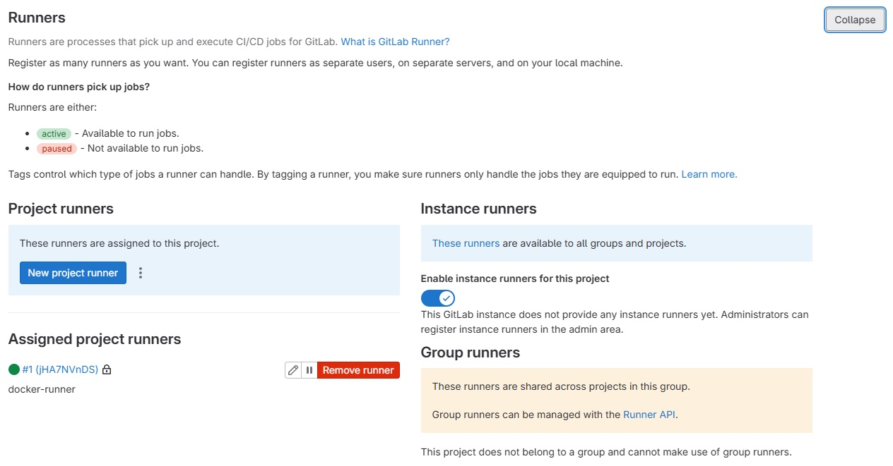
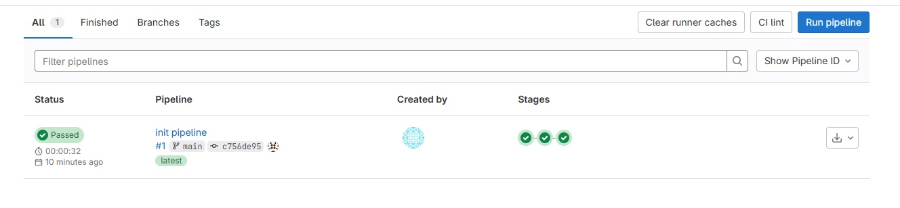

# Домашнее задание GitLab CI/CD — Штанько Богдан

## Задание 1

### Что сделано:
- Развернут GitLab через Vagrant
- Создан проект
- Зарегистрирован gitlab-runner (docker)

### Скриншот runner:


---

## Задание 2

### .gitlab-ci.yml:

```yaml
stages:
  - test
  - build
  - deploy

test-job:
  stage: test
  script:
    - echo "Running tests"

build-job:
  stage: build
  script:
    - echo "Building project"

deploy-job:
  stage: deploy
  script:
    - echo "Deploying project"
    
```
### Скриншот pipeline:
